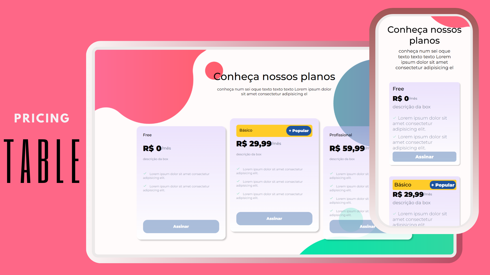

<h1 align="center">#6 Pricing Table </h1>
<h2 align="center">Uma página com tabelas de preços para escolher planos de produtos ou serviços.</h2>

    Uma página que exibe uma tabela comparativa dos diferentes preços e planos disponíveis para um produto ou serviço. Essa tabela permite aos usuários visualizar e comparar as opções disponíveis antes de tomar uma decisão de compra.

  <a href="#-tecnologias">Tecnologias</a>&nbsp;&nbsp;&nbsp;|&nbsp;&nbsp;&nbsp;
  <a href="#-projeto">Projeto</a>&nbsp;&nbsp;&nbsp;|&nbsp;&nbsp;&nbsp;
  <a href="#-layout">Layout</a>&nbsp;&nbsp;&nbsp;|&nbsp;&nbsp;&nbsp;
  <a href="#-instruções-de-cadastro">Instruções de Cadastro</a>

  

 

  

## 🚀 Tecnologias

Esse projeto foi desenvolvido com as seguintes tecnologias:

- HTML e CSS
- Git e Github
- Figma e Canva para design

## 💻 Projeto

Este projeto tem como objetivo o desenvolvimento de uma página da web que apresenta uma tabela de preços, permitindo aos usuários comparar e selecionar entre diferentes planos de produtos ou serviços oferecidos. A página será projetada para fornecer informações claras e concisas sobre cada plano, facilitando a tomada de decisão por parte dos visitantes.

## 🎨 Layout 

Design interativo torna a página de tabela de preços mais envolvente com elementos como efeitos "hover," botões de alternância, realce de recursos e feedback visual. Isso facilita as decisões dos usuários, aumenta as conversões e destaca a marca/produto.

## 🖼️ Preview

Você pode visualizar o layout do projeto através [DESSE LINK](<https://jasonaraujo1.github.io/projeto-pricing-table/>). 

## :memo: Licença

Esse projeto está sob a licença MIT.

---

Instruções pela [Sua Empresa/Equipe](https://seusite.com) :wave: [Participe da nossa comunidade!](https://discord.gg/sua-comunidade)
